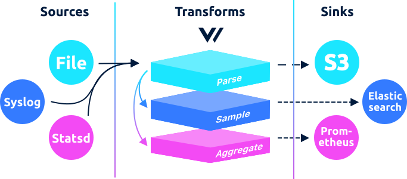

<!---
!!!WARNING!!!!

This file is autogenerated! Please do not manually edit this file.
Instead, please modify the contents of `dist/config/schema.toml`.
-->


# Configuration



This section covers configuring Vector and creating [pipelines](../../about/concepts.md#pipelines) like the one shown above. Vector requires only a _single_ [TOML](https://github.com/toml-lang/toml) configurable file, which you can specify via the [`--config` flag](../administration/starting.md#options) when [starting](../administration/starting.md) vector:

```bash
vector --config /etc/vector/vector.toml
```

## Example



```coffeescript
data_dir = "/var/lib/vector"

# Ingest data by tailing one or more files
[sources.nginx_logs]
    type         = "file"
    path         = "/var/log/nginx*.log"
    ignore_older = 86400 # 1 day

# Structure and parse the data
[transforms.nginx_parser]
    inputs       = ["nginx_logs"]
    type         = "format_parser"
    format       = "nginx"

# Sample the data to save on cost
[transforms.nginx_sampler]
    inputs       = ["nginx_parser"]
    type         = "sampler"
    hash_field   = "request_id" # sample _entire_ requests
    rate         = 10 # only keep 10%

# Send structured data to a short-term storage
[sinks.es_cluster]
    inputs       = ["nginx_sampler"]
    type         = "elasticsearch"
    host         = "79.12.221.222:9200"

# Send structured data to a cost-effective long-term storage
[sinks.s3_archives]
    inputs       = ["nginx_parser"] # don't sample
    type         = "s3"
    region       = "us-east-1"
    bucket       = "my_log_archives"
    buffer_size  = 10000000 # 10mb uncompressed
    gzip         = true
    encoding     = "ndjson"
```



## Global Options

| Key  | Type  | Description |
| :--- | :---: | :---------- |
| `data_dir` | `string` | The directory used for persisting Vector state, such as on-disk buffers. Please make sure the Vector projectt has write permissions to this dir.<br />`no default` `example: "/var/lib/vector"` |

## How It Works

### Composition

The primary purpose of the configuration file is to compose [pipelines](../../about/concepts.md#pipelines). Pipelines are formed by connecting [sources](sources/), [transforms](transforms/), and [sinks](sinks/). You can learn more about creating pipelines with the the following guide:



### Data Directory

Vector requires a `data_directory` for on-disk operations. Currently, the only operation using this directory are Vector's [on-disk buffers](sinks/buffer.md#on-disk). Buffers, by default, are [memory-based](sinks/buffer.md#in-memory), but if you switch them to disk-based you'll need to specify a `data_directory`.

### Environment Variables

Vector will interpolate environment variables within your configuration file with the following syntax:



```c
[transforms.add_host]
    type = "add_fields"
    
    [transforms.add_host.fields]
        host = "${HOSTNAME}"
```



The entire `${HOSTNAME}` variable will be replaced, hence the requirement of quotes around the definition.

#### Escaping

You can escape environment variable by preceding them with a `$` character. For example `$${HOSTNAME}` will be treated _literally_ in the above environment variable example.

### Format

The Vector configuration file requires the [TOML](https://github.com/toml-lang/toml#table-of-contents) format for it's simplicity, explicitness, and relaxed white-space parsing. For more information, please refer to the excellent [TOML documentation](https://github.com/toml-lang/toml#table-of-contents).

#### Value Types

All TOML values types are supported. For convenience this includes:

* [Strings](https://github.com/toml-lang/toml#string)
* [Integers](https://github.com/toml-lang/toml#integer)
* [Floats](https://github.com/toml-lang/toml#float)
* [Booleans](https://github.com/toml-lang/toml#boolean)
* [Offset Date-Times](https://github.com/toml-lang/toml#offset-date-time)
* [Local Date-Times](https://github.com/toml-lang/toml#local-date-time)
* [Local Dates](https://github.com/toml-lang/toml#local-date)
* [Local Times](https://github.com/toml-lang/toml#local-time)
* [Arrays](https://github.com/toml-lang/toml#array)
* [Tables](https://github.com/toml-lang/toml#table)

### Location

The location of your Vector configuration file depends on your [platform](../../setup/installation/platforms/) or [operating system](../../setup/installation/operating-systems/). For most Linux based systems the file can be found at `/etc/vector/vector.toml`.


